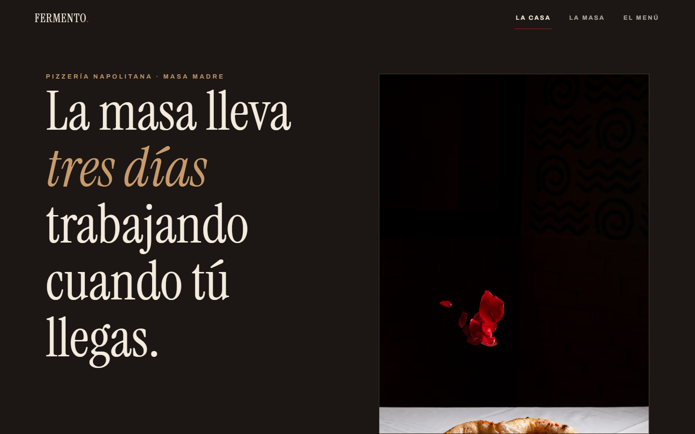
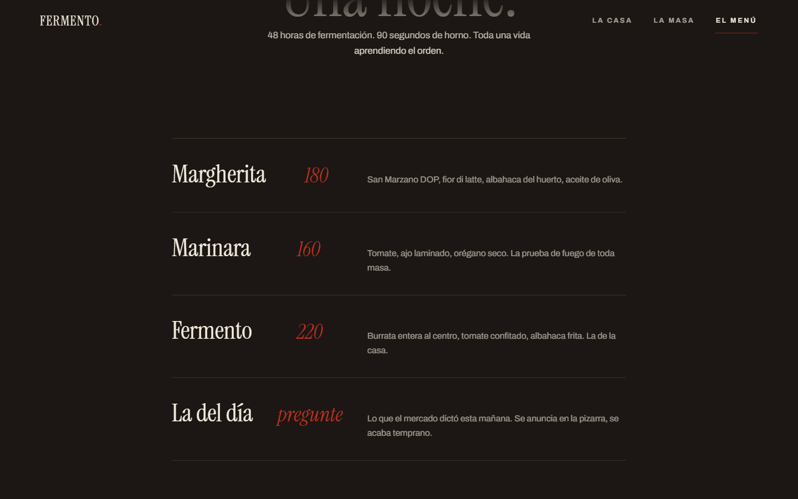

[English](README.en.md) · **Español**

# FERMENTO — Pizzería napolitana de masa madre

**Ver en vivo → [https://b0b1a6ae23.github.io/fermento-pizzeria/](https://b0b1a6ae23.github.io/fermento-pizzeria/)**


Sitio **multi-página** de pizzería napolitana (La casa / La masa / El menú) que se
siente como una SPA: transiciones de *telón de harina* entre páginas reales con
**Barba.js** y scroll con inercia + parallax con **ScrollSmoother**.

| La casa | El menú |
| --- | --- |
|  |  |

## Técnicas

- **Barba.js 2 + prefetch**: intercepta la navegación, intercambia el contenedor
  sin recarga, telón con sello SVG (`back.out`), historial y título por página.
- **ScrollSmoother** recreado por página: `effects` con `data-speed="auto"`
  (las fotos respiran dentro de marcos con overflow) y `data-lag` en el menú.
- Costura Barba ↔ GSAP depurada y documentada:
  1. El hook global `beforeEnter` también dispara en la carga inicial (y es
     asíncrono) — un solo camino de inicialización, sin redes de seguridad.
  2. Durante la transición coexisten ambos contenedores → los ScrollTriggers
     nacen con posiciones dobladas → `ScrollTrigger.refresh()` en `hooks.after`
     (rAF) es obligatorio.
- Videos self-hosted del horno y la masa; fotos Pexels con `srcset` runtime.
- Dirección de arte investigada (pizzerías napolitanas de culto): Instrument
  Serif + Archivo, paleta horno (carbón/harina/San Marzano), menú corto con
  precios enteros.

## Cómo correr

```bash
npx http-server . -p 8080
```

Requiere servidor: Barba hace `fetch` de las páginas.

## Licencia

Código bajo licencia [MIT](LICENSE). **FERMENTO** es una marca ficticia creada para demostrar trabajo de portafolio; cualquier parecido con un negocio real es coincidencia. Los recursos de terceros (fotografías, videos y modelos 3D) conservan la licencia original de sus autores — ver Créditos.

## Créditos

Fotografía y video: [Pexels](https://www.pexels.com).

---
**Ángel Josué García Cantero** · Serie *páginas-película*.